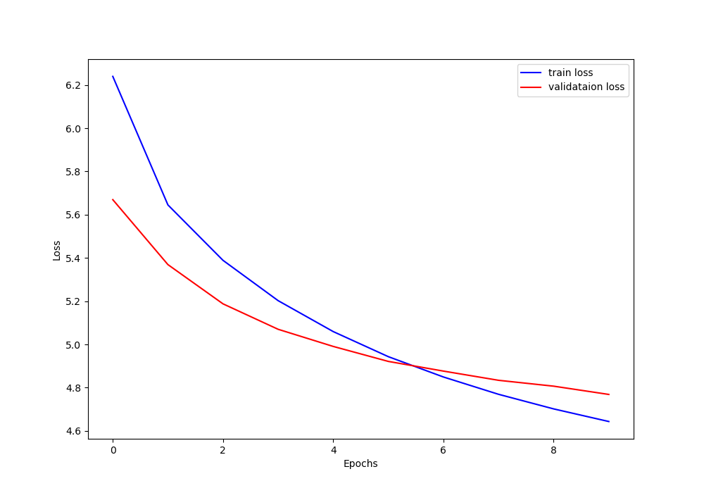

# mandarin-to-english-model

This is a Chinese-English translation model trained using the 7% data set at https://huggingface.co/datasets/SouthernCrossAI/English_to_Mandarin.

src_vocab.pth and tgt_vocab.pth respectively represent the Chinese vocabulary list and English vocabulary list completed during the model training process.

The currently obtained model is large in size and has poor performance, but it is found that every 2% more training data used will bring very obvious optimization to the performance.

By running the translate_test.py file, you can import the model file and vocabulary file, thereby achieving the effect of manually inputting Chinese and translating it into English.
